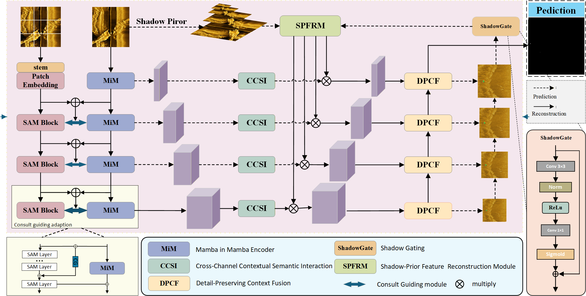

# SPFR-SAM: Shadow-Prior Feature Reconstruction with SAM-Guided Encoding for Side-Scan Sonar Small Target Detection

> **🚧 Coming Soon** — Code, annotations, and pretrained weights will be released upon acceptance of the paper.

Yinghua Song, Guanying Huo, Simon X. Yang, Zhen Cheng, and Weifeng Kong

College of Information Science and Engineering, Hohai University · School of Engineering, University of Guelph

*Submitted to IEEE Journal of Selected Topics in Applied Earth Observations and Remote Sensing (JSTARS)*

---

## Overview

In side-scan sonar (SSS) imagery, targets and their accompanying shadows are spatially coupled with ambiguous boundaries, while backgrounds are dominated by speckle noise and target-to-clutter contrast remains extremely low. **SPFR-SAM** addresses pixel-level SSS small target detection by jointly modeling small targets and their shadows:

- **SAMiM encoder** — a frozen SAM2-Hiera branch and a trainable MiM branch interact through a Consult-Guide mechanism, transferring generic mask and boundary priors to the sonar domain.
- **CCSI** (Cross-Channel Contextual Semantic Interaction) — captures lateral target–shadow relations and cross-channel semantic dependencies in the skip connections.
- **DPCF** (Detail-Preserving Context Fusion) — fuses multi-scale features to produce an initial detection response.
- **SPFRM** (Shadow-Prior Feature Reconstruction Module) — embeds a short-shadow prior into multi-scale feature reconstruction, suppressing pseudo-shadows and misaligned highlight–shadow responses.

  

## Main Results

| Dataset   | IoU (%) | nIoU (%) | F1 (%) | Pd (%) | Fa (10⁻⁵) |
| --------- | :-----: | :------: | :----: | :----: | :-------: |
| Cylinder2 |  53.15  |  52.96   | 69.41  | 85.42  |   0.85    |
| MOD       |  50.01  |  46.68   | 66.68  | 85.12  |   0.74    |

All models are trained and evaluated at 512 × 512 resolution.

## Release Plan

- [ ] Source code of SPFR-SAM (SAMiM encoder, CCSI, DPCF, SPFRM)
- [ ] Pixel-level mask annotations for the MOD and Cylinder2 splits used in the paper
- [ ] Configuration files and training scripts (512 × 512 protocol, optimizer, schedule)
- [ ] Pretrained weights for the checkpoints reported in the paper
- [ ] Training protocols for the comparison baselines

## Citation

The citation will be provided once the paper is published.

## Contact

For questions, please contact Guanying Huo (huoguanying@hhu.edu.cn) or Simon X. Yang (syang@uoguelph.ca).
